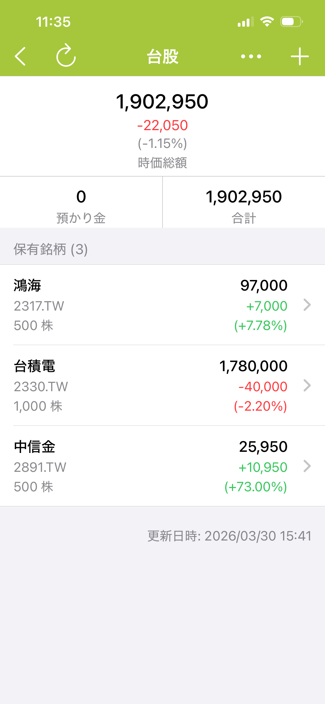

# 股票資產管理 使用指南

> 適用版本：8.0 以上

股票資產管理的主要功能包括：

1. 持倉管理 — 記錄買入、賣出、股利交易，輕鬆掌握每檔持股狀況
2. 損益報告 — 自動計算浮動損益與報酬率，並提供已實現損益的詳細報告
3. 股價自動更新 — 每天收盤後自動抓取最新市場行情， 支援台股、美股、日股、港股等多個市場
4.  資產統計 — 股票資產與其他帳戶一同納入整體資產概覽.

    

## 使用指南


[create-stock-account.md](guides/create-stock-account.md)



[add-stock-position.md](guides/add-stock-position.md)



[record-transactions.md](guides/record-transactions.md)



[unlock-features.md](guides/unlock-features.md)


### FAQ


[auto-update-stock-price.md](faq/auto-update-stock-price.md)



[record-us-stocks.md](faq/record-us-stocks.md)



[split-stock.md](faq/split-stock.md)

