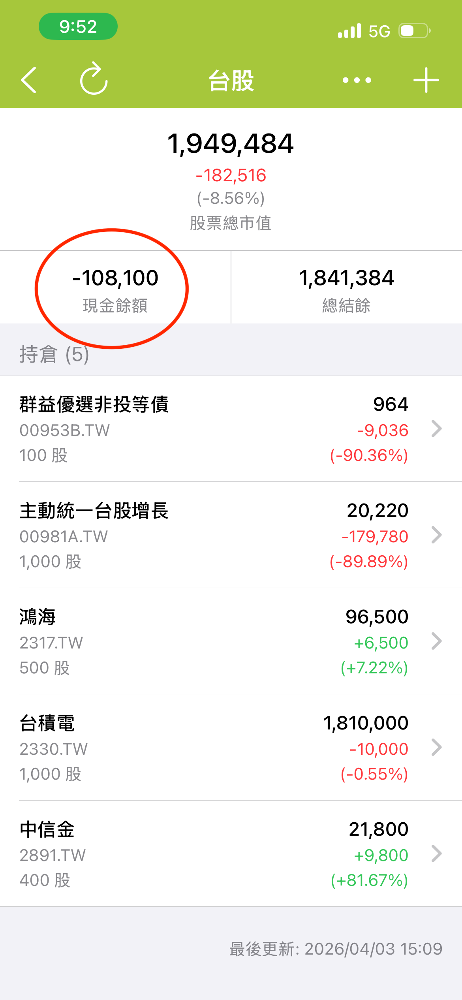

# 為什麼「天天記帳」的股票帳戶沒有綁定「交割戶」銀行帳戶？買股票的資金是怎麼運作的？

「天天記帳」現在的股票功能，**是將股票帳戶當成一個內建的資金專戶**，因此目前**沒有另外獨立的「交割戶」設計**。


~~<mark style="color:$info;">**我們會在今後版本加入交割戶相關功能**</mark>~~&#x20;

<mark style="color:$primary;">**天天記帳最新版本已經支援交割戶帳戶設定**</mark>


這代表：

* **從其他帳戶轉進股票帳戶的錢或者股票帳戶的初始金額**，會直接作為買股資金
* **買股票時**，會直接從股票帳戶內的可用資金扣除
* **賣股票時**，賣出所得款項也會**退回股票帳戶**
* 目前不需要另外綁定銀行交割戶，股票帳戶本身就同時負責**持股管理**與**資金收付**

另外，圖片紅圈處顯示的 \*\*\*\*，就是這個內建資金專戶目前可用的金額。

* **現金餘額為正數**：表示股票帳戶內還有可用資金
* **現金餘額為負數**：表示您目前有**透支買股**的情況，需再從其他帳戶轉入資金，補足股票帳戶餘額

<figure><figcaption></figcaption></figure>

