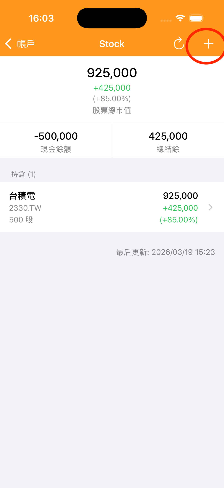

---
metaLinks:
  alternates:
    - https://app.gitbook.com/s/Hseb2PqmAac4uS7KJtxo/guides/zhang-ben-gong-xiang
---

# 新增持股

進入股票帳戶詳情頁，點擊右上角「＋」按鈕，輸入股票代碼、買入數量與單價，即可建\
立持倉。

1. 進入股票帳戶詳情頁，點擊右上角的「＋」\
   
2. 輸入股票代碼（例如：2330）與股票名稱（例如：台積電） 
3. 輸入買入數量與單價 
4. 點擊「儲存」。

