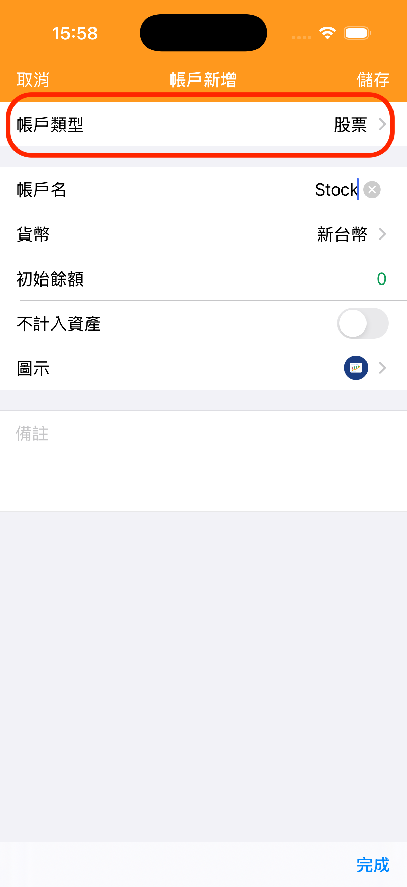

---
metaLinks:
  alternates:
    - >-
      https://app.gitbook.com/s/Hseb2PqmAac4uS7KJtxo/guides/icloud-yun-zhang-ben-she-ding
---

# 新增股票帳戶

股票帳戶是一個專門用來記錄股票投資的帳戶

1. 前往「帳戶」頁面，點擊右上角的「＋」新增帳戶。 
2. 帳戶類型選擇「股票」。\
   
3. 輸入帳戶名稱（例如：台股帳戶、美股帳戶）。
4. 選擇帳戶幣別。

    > **提示：** 幣別會決定可選的市場。例如選擇台幣（TWD），系統將自動顯示台股市場。
5. 儲存後，該帳戶就會出現在帳戶清單中，點擊即可進入股票資產管理。

